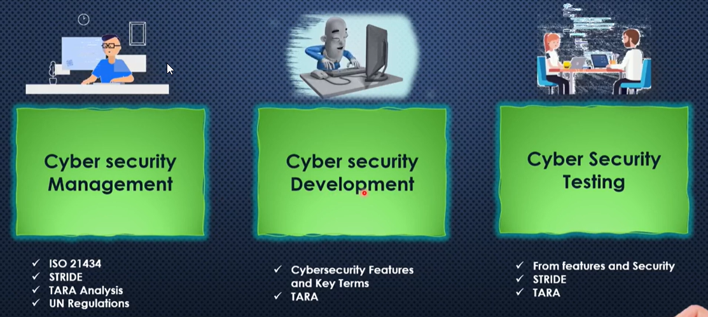

# Overview
## Cybersecurity
Cybersecurity is protecting internet-connected devices and services by
**NOT**:

- Accessing, changing, or destroying sensitive information.
- Extorting money from users.
- Interrupting normal business processes.
## Automotive cybersecurity
Automotive cybersecurity is the protection of vehicle electronic systems, communication networks, control algorithms, software, users, and underlying data from:

- Malicious attacks,
- Damage
- Unauthorized access, or manipulation.

## Attack vectors
Attack vectors is methods that attackers use to gain unauthorized access to computer system, networks or data. They represent the routes through which cyber threats can exploit vulnerabilities such as phishing emails, malicious websites, infected usb drives, unsecured networks, or software vulnerabilities.

For example, In automotive, There are latest trending vehicles, which has sophisticated features and many advancements in real-life features. These features have any cyber security vulnerability that gives a chance to hacker to get into the system. Those are

- Telematics and application server:
- Infotainment system:
- API
- ECUs(TCU, GW, etc.):
- Remote keyless entry system:
- EV charging
- Database
- GPS/GNSS navigation system.
- mobile applications
- Bluetooth
- CAN bus
## Trending Cyber attacks

Cyber attacks refers to malicious attempts to damage, disrupt, or gain unauthorized access to computer systems, networks, or devices. In the context of automotive cybersecurity, these attacks can significantly impact vehicle systems, and operations.

## Roles in automotive Cybersecurity

## Need of standard bodies

- Defining security requirements: They create guidelines and best practices for manufacturers to follow, ensuring all vehicles meet minimum cybersecurity standards.

- Ensuring interoperability: Standards help different systems and components from various suppliers work securely together.
Facilitating compliance: Regulatory bodies and governments often require adherence to recognized standards (e.g., ISO/SAE 21434, UN R155) for market approval.
- Improving safety and trust: Standards help reduce vulnerabilities, protect user data, and increase consumer confidence in connected vehicles.
Enabling incident response: They provide frameworks for reporting, managing, and responding to cybersecurity incidents across the industry.