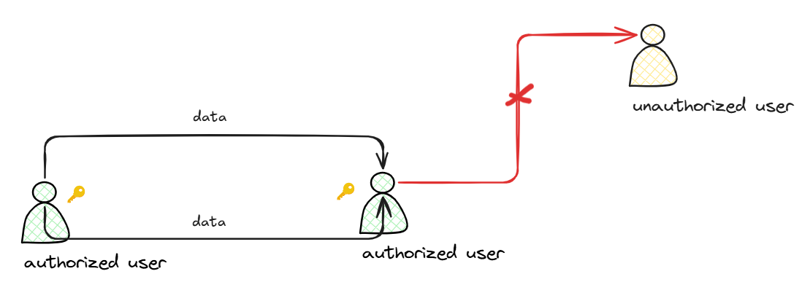

# CIA
CIA triad is a basic property of security. C stands for Confidentiality, I for Integrity, A for Availability.

These terms are foundation of cybersecurity, ensuring information system and data are protected from various threats and attack vectors.
## Confidentiality
Confidentiality ensures that information is accessible only tho authorized users. It prevents unauthorized individuals or systems from viewing sensitive data.

For example:

## Integrity
## Availability
