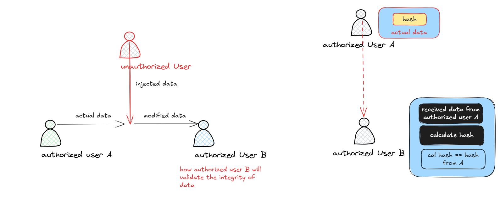

# CIA
CIA triad is a basic property of security. C stands for Confidentiality, I for Integrity, A for Availability.

These terms are foundation of cybersecurity, ensuring information system and data are protected from various threats and attack vectors.
## Confidentiality
Confidentiality ensures that information is accessible only the authorized users. It prevents unauthorized individuals or systems from viewing sensitive data.

For example:

Examples mechanisms: Encryption, decryption, access controls, data masking.
## Integrity
Integrity ensures that data is accuracy and unaltered by unauthorized individuals. It involves maintaining the consistency, accuracy, and trustworthiness of data.

Examples mechanisms: Hashing, Digital Signature, monitoring

## Availability
Availability ensures that information and systems are accessible to authorized users when needed. It involves maintaining and ensuring reliable access to data and services.

Example mechanisms: Redundancy, Maintenance, Failsafe/Rollback or Limp home, back up mechanisms